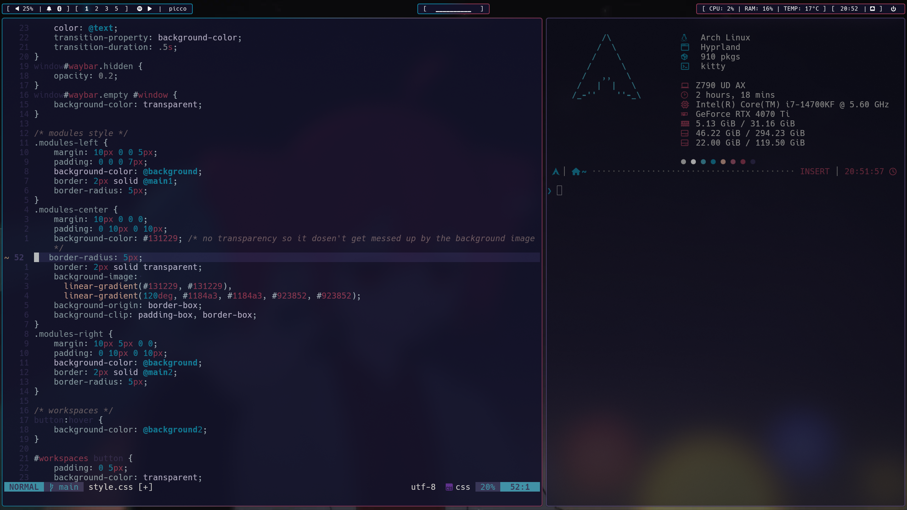

# My arch+hyprland dotfiles project themed around Hatsune Miku and Kasane Teto (Work in Progress)
## Screenshots:



## Dependencies:
### Base:
- hyprland
- waybar
- swaync
- kitty
- rofi
- zsh
- Hack Nerd Font
### Programs:
- vesktop
- btop
- cava
- fastfetch
- firefox
- fzf
- neovim
- wlogout
- yazi
### Hyprland utilities:
- hyprlock
- pyprland
- hyprshot 
- hyprquickshot
- hyprsunset
- hyprpicker
### Programs that the custom bash scripts use
- playerctl/MPRIS
- upower
- powerprofilesdaemon 

## Installation:
Get the packages listed above using your distros package manager

run 
```sh
git clone https://github.com/MWidzi/dotfiles-Miku-Teto/ ~/Dotfiles
```
for the scripts to run correctly
> I will fix this later to point to .config

Most of the project relies on symlinks - ensure that none of the programs above except for vesktop have folders in .config and create a symlink for every folder in the cloned repo except for firefox and Discord - for Discord run
```sh
rm -rf ~/.config/vesktop/themes ~/.config/vesktop/settings ~/.config/vesktop/settings.json
cp -r ~/Dotfiles/Discord/* ~/.config/vesktop
```
> [!WARNING]
> This will remove any previous settings you had so back that up before you run

for firefox refer to the .txt note in firefox folder

> I might make a install script later on if i feel like it, for now it's manual install only

after you've done everything restart your session and if something isn't working reboot the system, should be fine
